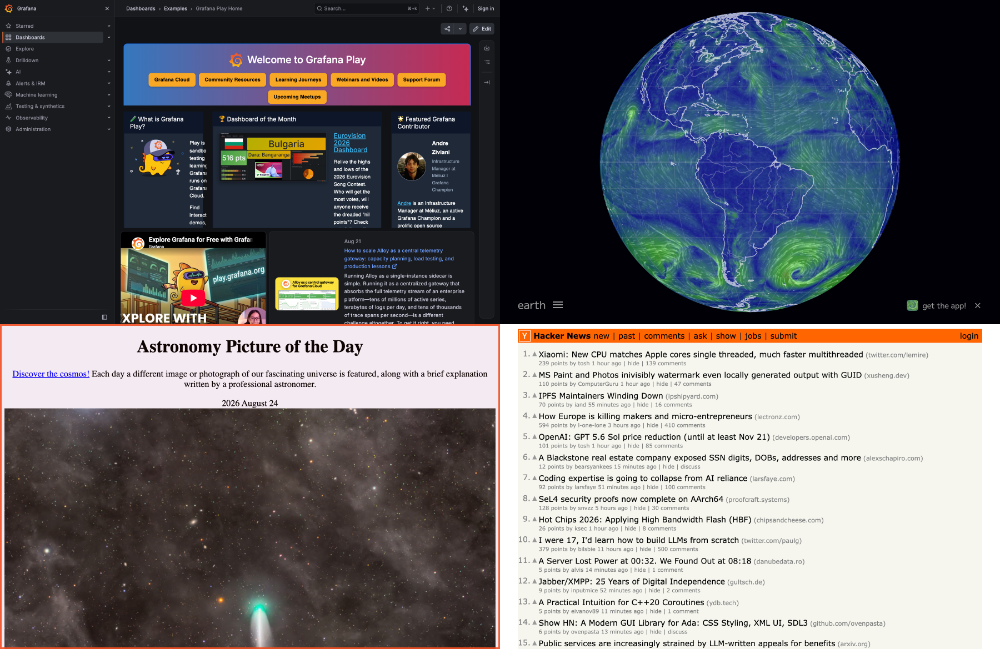
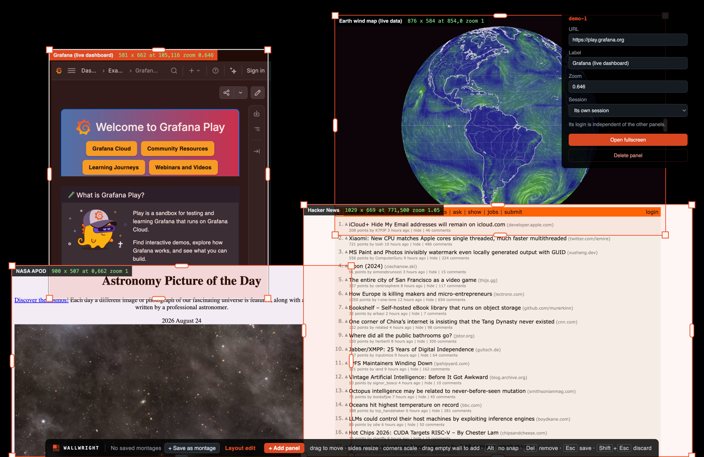

# Forge

Forge puts live web pages on a big screen, side by side, with no browser
chrome. Each panel is a real, interactive browser view: real logins, real
sessions, live data. Not a video feed or a screenshot, so someone standing at
the wall can actually use the pages.

It was built for the "Next Gen Control Room" LED wall exhibit, showing
Honeywell dashboards, but nothing in it is specific to that: any montage of
live pages works.



Every panel is live and usable where it sits, so the wall is a working montage
rather than one usable page at a time. A panel can also be opened to fill the
whole wall and then put back with Esc; promoting it does not reload it, so a
login survives the round trip. If the wall is left alone for a while it returns
to the grid on its own.

Only administrators drive it, with a keyboard and mouse at the wall or over
remote access. Visitors look.

## Building a montage at the wall

The layout is not baked in. `Ctrl/Cmd+Shift+E` opens an editor on top of the
live pages, so a montage can be arranged against the real dashboards, at the
real wall resolution, without editing a config file on site.



Select a panel and an inspector lets you change its **URL**, label, zoom and
session, or delete it. Add panels by dragging out a rectangle on empty wall.
Panels snap to each other and to the wall edges, so they tile without seams.

| gesture                   | effect                                                 |
| ------------------------- | ------------------------------------------------------ |
| drag a panel's body       | move it                                                |
| drag a **side** handle    | resize one axis; the page reflows into the new shape   |
| drag a **corner** handle  | scale it; the page zooms with the frame, like an image |
| drag on **empty wall**    | draw a new panel                                       |
| click a panel             | select it, opening the inspector                       |
| `Del` / `Backspace`       | delete the selected panel                              |
| hold `Alt` while dragging | turn snapping off                                      |
| `Esc` / `Shift`+`Esc`     | save the montage / discard the changes                 |

Sides and corners do deliberately different things. Resizing from a side gives
the page a new viewport and lets it reflow. Scaling from a corner keeps the
proportions and scales the page itself, which is what enterprise dashboards
need when they refuse to reflow to an arbitrary shape.

## Sessions and logins

Each panel keeps its own cookies and session, and they survive restarts, so an
operator logs in once and the wall stays logged in. SSO popups are allowed, so
identity providers that open a window work.

Panels can also **share** a session. Several panels showing the same
SSO-protected app should sit behind one login rather than making someone sign
in once per panel, and the inspector's Session menu is where that is chosen.

## Using it at the wall

There is no touchscreen. Everything is done with one wireless keyboard and
mouse at the wall itself, or over remote access.

| key                | what it does                                   |
| ------------------ | ---------------------------------------------- |
| click a panel      | use the page, exactly as in a browser          |
| `Ctrl/Cmd+Shift+P` | open-a-panel mode; click one to fill the wall  |
| `Esc`              | back to the grid                               |
| `Ctrl/Cmd+Shift+E` | open or close the layout editor                |
| `Ctrl/Cmd+F`       | switch between filling the screen and a window |
| `Ctrl/Cmd+Shift+Q` | quit                                           |

Typing goes to whichever panel was clicked last, the way tabs work in a browser.

Opening a panel fullscreen is its own mode rather than a click, because a click
in the grid belongs to the page underneath. The layout editor's inspector can
also open the selected panel directly.

## Download

Installers are attached to each [release](https://github.com/Potion/hon-forge/releases):
a Windows installer, a Windows zip for machines where an installer cannot be
run, and macOS disk images for Apple Silicon and Intel.

They are **not code signed yet**, so both operating systems will complain the
first time:

- **Windows** may show a SmartScreen warning.
- **macOS** quarantines the app. Open it once with right-click then Open, or run
  `xattr -dr com.apple.quarantine /Applications/Forge.app`.

Signing needs certificates that do not exist yet; see [Signing](#signing).

## Where the montage is stored

Installed, the app keeps its config in the user data directory and reads and
writes that copy, so a layout arranged at the wall survives a reinstall:

|         |                                                 |
| ------- | ----------------------------------------------- |
| Windows | `%APPDATA%\Forge\wall.json`                     |
| macOS   | `~/Library/Application Support/Forge/wall.json` |

Setting `FORGE_CONFIG` to a path overrides it.

## Status

Working and demonstrable. The interaction model, the editor, session
persistence, packaging and CI are all in place, and the architecture's central
assumption (that a transparent overlay composites over live browser views) is
confirmed on macOS.

The most important thing **not** yet confirmed is that same compositing on
Windows, which is what the show PC runs. `docs/validation.md` records what has
actually been observed running versus what is still assumed, grouped by where
each remaining check can be done. `AGENTS.md` has the implementation checklist
and the decisions still open.

---

# Development

Target is Windows; development is on macOS. Requires Node 18+ and Electron 43+
(for `BaseWindow`, `WebContentsView`, `View.setVisible` and animated
`View.setBounds`).

## Stack

Electron, using one `BaseWindow` for the wall with a `WebContentsView` per
panel, plus a transparent `WebContentsView` overlay for the click targets, the
Back button and the editor. No compositor and no video capture: the pages stay
live and interactive, which is the whole reason for this design rather than a
capture-based one. `SPEC.md` has the reasoning and the alternatives that were
rejected.

## Run

```sh
npm install

# Development: serves four local mock dashboards and opens a windowed wall.
# This is how to exercise the app without the real Honeywell URLs.
npm run dev

# Production-shaped run against config/wall.json (fullscreen).
npm start
FORGE_CONFIG=./config/local-demo.json npm start

npm test      # config and layout geometry
npm run lint
npm run probe # check the Electron view APIs on this platform
npm run probe:fs # check which fullscreen path covers the display
```

In dev, `Cmd/Ctrl+Shift+I` opens devtools for the active panel and
`Cmd/Ctrl+Shift+G` forces a return to the grid.

### Dev flags

With `FORGE_DEV=1`:

| variable                | effect                                           |
| ----------------------- | ------------------------------------------------ |
| `FORGE_START_EDIT=1`    | boot straight into the layout editor             |
| `FORGE_SELECT=<id>`     | select that panel, so the inspector is open      |
| `FORGE_SELFTEST=1`      | run the panel CRUD smoke test, logging each step |
| `FORGE_CAPTURE_OUT=...` | capture the wall to a PNG and exit               |

`FORGE_SELFTEST` exists because nothing in `src/main.js` has unit tests: it
imports electron at module scope. It drives the real path instead, through the
overlay's bridge and over IPC into the same handlers a click reaches, covering
add, URL change, session sharing, zoom and delete.

## Platform notes

On macOS the wall uses **simple** fullscreen. Every native fullscreen and kiosk
path reports success while leaving the menu-bar strip uncovered, which shows up
as a black gap across the top of the wall. See `docs/validation.md` and
`npm run probe:fs`.

Owning the whole display also means that on a notched MacBook, page content sits
under the camera housing. The deployment machines have no notch, so this is
opt-in rather than automatic: set `wall.safeAreaTop` to `"auto"` in a local dev
config and the wall is laid out below the notch instead. The editor's own
toolbar sits at the bottom of the screen for the same reason.

## Screenshotting the wall

```sh
FORGE_CONFIG=./config/my-wall.json \
FORGE_CAPTURE_OUT=./wall.png \
npm run capture

# ... and the editor, with a panel selected
FORGE_START_EDIT=1 FORGE_SELECT=demo-2 ... npm run capture
```

Captures each panel from its own `webContents` plus the overlay, and composites
them at their wall coordinates. It needs no OS screen-recording permission, so
it works where `screencapture` cannot run at all: a terminal without that
permission, a CI runner, a headless show PC. The images at the top of this file
were made with it.

`FORGE_CAPTURE_SETTLE` (default 7000ms) is how long to wait after load before
capturing; raise it for pages with charts or maps that draw late.
`FORGE_CAPTURE_DPR` (default 1) captures at a higher pixel ratio.

## Configure

Everything layout- and content-related lives in the config file, so URLs,
rectangles and per-panel zoom change without touching code. The layout editor
writes this file.

```jsonc
{
  "wall": {
    "width": 3840,
    "height": 2160,
    "backgroundColor": "#000000",
    "displayLabel": null, // match screen.getAllDisplays().label to pick the wall output
    "displayId": null, // or match by display id
    "kiosk": true,
    "fullscreen": true,
    "fitToDisplay": true, // scale and centre the authored layout into the window
    "safeAreaTop": null, // "auto" keeps the wall clear of a MacBook notch
  },
  "idleReturnMs": 240000, // auto-return to grid after inactivity (0 = never)
  "showHotspotHint": true, // subtle hover highlight on the panels in grid mode
  "hideInactiveWhenActive": false, // hide the others while one is fullscreen
  "transitionMs": 220, // promote/return animation (0 = snap)
  "escToGrid": "single", // "single" | "double" | "off"  (see AGENTS.md)
  "idleResetUrls": false, // on idle, also put panels back to their configured URLs
  "recentUseMs": 60000, // how long a touched panel is protected from a watchdog reload
  "backButton": { "x": 24, "y": 24, "width": 176, "height": 56 },
  "views": [
    // May be empty: a montage can be built from a blank wall in the editor.
    {
      "id": "view-1",
      "label": "Dashboard 1",
      "url": "https://.../dashboard-1",
      "grid": { "x": 0, "y": 0, "width": 1920, "height": 1080 },
      "zoom": 1.0, // per-panel scale, independent of the others
      "partition": "persist:forge-1", // persistent session; may be shared with another panel
      "allowedOrigins": [], // empty = permissive; populate to lock navigation down
    },
  ],
}
```

The committed `config/wall.json` uses placeholder `example.com` URLs. Local
configs matching `config/local*.json` are gitignored, which is where real or
demo URLs belong.

## Build

```sh
npm run build:win      # Windows: NSIS installer + zip, into dist/
npm run build:mac      # macOS: arm64 and x64 dmgs
npm run build:mac:dir  # macOS: unpacked .app only, faster, for a quick check
npm run icon           # regenerate build/icon.png
```

Packaging is electron-builder, configured in `electron-builder.yml`. Windows
builds run in CI on `windows-latest`, which is the only place they are known to
work: building a Windows installer from macOS is not part of this setup.

### Signing

Every build is currently unsigned, because there is no certificate for either
platform.

- **Windows:** set `CSC_LINK` and `CSC_KEY_PASSWORD` as repository secrets;
  electron-builder picks them up with no config change.
- **macOS:** `identity: null` in `electron-builder.yml` disables signing
  outright. To sign and notarize, remove that line and add `CSC_LINK`,
  `CSC_KEY_PASSWORD`, `APPLE_ID`, `APPLE_APP_SPECIFIC_PASSWORD` and
  `APPLE_TEAM_ID`.

A signed build is easier for Honeywell IT to approve, which is an open question
in `AGENTS.md`.

## CI

Four GitHub Actions workflows:

- **CI** (`ci.yml`) - lint and tests on every push to `main` and every PR, on
  both Ubuntu and Windows. Installs with `--ignore-scripts` to skip Electron's
  binary download, which the tests do not need.
- **Build Windows** (`build-windows.yml`) - on a `v*` tag or manual dispatch,
  attaching artifacts to the matching release. Not on every push: Windows
  runners bill at 2x on a private repo.
- **Build macOS** (`build-mac.yml`) - same triggers. macOS runners bill at 10x,
  so this one especially is not on every push.
- **Probe Windows** (`probe-windows.yml`) - manual. Runs the two Electron probes
  on a Windows runner to answer open platform questions in
  `docs/validation.md`. A runner is not the show PC, so treat it as a signal
  rather than sign-off.

Cutting a release is `gh release create vX.Y.Z`: the tag triggers both builds,
and each uploads its own artifacts.

## Files

- `src/main.js` - Electron main process: window, panels, overlay, the
  grid/active/edit state machine, panel lifecycle, sessions, watchdog, idle
  return, capture.
- `src/config.js` - config loading, validation, defaults, and writing the panel
  list back. No electron import, so it is testable with plain node.
- `src/layout.js` - pure layout geometry: clamping a panel to the wall and
  snapping its edges. Also electron-free.
- `src/preload.js` - the overlay's bridge: promote a panel, go back, edit the
  layout, receive state.
- `src/content-preload.js` - injected into each page only to report user
  activity so the idle timer resets during use. Exposes nothing to the page.
- `src/overlay.html` / `src/overlay.js` - the transparent layer: hotspots, the
  Back button, and the whole layout editor.
- `src/dev/` - dev-only, never shipped: `dev.js` launcher, `mock-server.js` and
  the mock dashboards under `mock/`, `probe.js` and `fsprobe.js` for checking
  Electron behaviour, `capture.js`, and `make-icon.js`.
- `test/` - config and geometry tests (`npm test`).
- `config/wall.json` - layout and content config.
- `electron-builder.yml` - packaging. `build/icon.png` is the source image.
- `docs/validation.md` - what has been observed running, and what has not.
