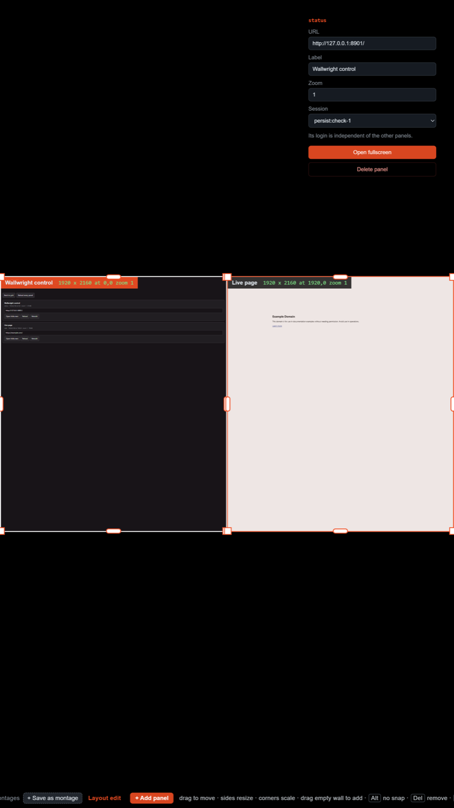

# Wallwright validation record

What has actually been observed running, versus what is still assumed. The point
of this file is the "Known risks / things to validate" section of `SPEC.md`: the
overlay architecture was chosen over capture-based approaches on the assumption
that a transparent `WebContentsView` composites over its siblings, and that
promoting a panel does not disturb its session. Both are now confirmed on the dev
machine.

Every result below is from the dev harness (`npm run dev`), which serves four
local mock dashboards instead of the real Honeywell URLs. See "Not yet
validated" for what that harness cannot tell us.

## Environment

|                 |                                                             |
| --------------- | ----------------------------------------------------------- |
| Date            | 2026-08-21                                                  |
| Electron        | 43.4.1 (Chromium 150.0.7871.224)                            |
| Platform        | macOS 25.5.0 (darwin), dev machine                          |
| Config          | `config/local-dev.json`, 1600x900 wall, four 800x450 panels |
| Target platform | Windows, **not yet tested**                                 |

## Confirmed

### Overlay alpha compositing: WORKS

A transparent `WebContentsView` sized to the whole wall, added last so it sits
on top, composites correctly over the four sibling content views. All four mock
dashboards render normally with the full-wall overlay above them.

This is the decision gate from `SPEC.md`. **None of the three documented
fallbacks are needed on macOS.** Re-test on the Windows show PC before
considering this closed, since that is the platform that actually matters.

### Layout editor: WORKS

`Ctrl/Cmd+Shift+E` enters layout edit mode. Confirmed by observation plus the
numbers in the log: a corner drag on `view-4` produced

```
view-4: 2063x1161 at 1777,998 zoom 0.806 (wall units)
```

2063 x 1161 is exactly 16:9, so the aspect lock holds, and 0.806 is
`0.75 * (2063 / 1920)`, so the page zoom tracked the frame proportionally. That
is the corner-drag contract: **corners scale**, content follows the frame.

Side handles, body drag, snapping, and save-on-Esc are all confirmed too. See
"Edge snapping" below for the numbers. Still unconfirmed: that Shift+Esc
discards rather than saves.

### Edge snapping: WORKS

Panel edges snap to each other, to the wall edges, and to the wall centre lines,
with cyan guide lines drawn while a drag is live. Hold Alt to defeat it.

Snapping happens twice on purpose. The overlay snaps in window pixels so the
drag feels right under the hand, then the main process re-snaps the driven edge
in wall units before anything is saved. Without the second pass, an edge that
looked snapped while previewing a 4K layout on a laptop could save as 1919
against a neighbour's 1920, which is a visible seam at wall resolution.

Confirmed from a live session:

```
view-3: 1498x1080 at 0,1080     zoom 1
view-4: 2342x1080 at 1498,1080  zoom 0.75
view-4: 2342x1308 at 1498,851   zoom 0.75
view-4: 2784x1555 at 1056,605   zoom 0.892
layout saved to .../smoke.json
```

- view-3's right edge is `0 + 1498`, view-4's left edge is `1498`. **Exact, no
  seam.** view-4's right edge is `1498 + 2342 = 3840`, the wall edge, also exact.
- Heights stayed at exactly 1080 through the horizontal drags, and widths at
  exactly 2342 through the vertical one. A side drag touches one axis only, and
  the untouched axis no longer drifts a unit from the pixel round trip.
- Zoom held at 1 and 0.75 through every side drag, then moved to 0.892 on the
  corner drag: `0.75 * (2784 / 2342)`. Aspect went 2342/1308 = 1.7905 to
  2784/1555 = 1.790, preserved.

34 tests cover this geometry (`test/layout.test.js`), including a case asserting
that snapped neighbours share an exact edge.

### Fullscreen on macOS needs simple fullscreen, not kiosk

Every native fullscreen and kiosk path reports `isFullScreen: true` while
stopping 39px short of the top of the display, leaving the menu-bar strip
uncovered. On the wall that is a black gap across the top, and the layout gets
scaled to fit 1130px instead of 1169px. Measured with `npm run probe:fs` on
Electron 43.4.1, 1800x1169 display:

| variant                            | content bounds | covers display |
| ---------------------------------- | -------------- | -------------- |
| constructor `fullscreen` + `kiosk` | y:39 h:1130    | no             |
| constructor `kiosk` only           | y:39 h:1130    | no             |
| constructor `fullscreen` only      | y:39 h:1130    | no             |
| `setKiosk(true)` after creation    | y:39 h:1130    | no             |
| `setSimpleFullScreen(true)`        | **y:0 h:1169** | **yes**        |

So on darwin the app uses `setSimpleFullScreen`, applied after construction
rather than as a constructor option. Confirmed fixed: the log now reads
`layout 1800x1169 in a 1800x1169 window, 1:1`.

**Windows is unverified.** It is expected to behave with the normal fullscreen
path, and `applyFullscreen()` branches on platform on that assumption. Run
`npm run probe:fs` on the show PC to confirm before trusting it.

### Layout must be recomputed after the window settles

Entering fullscreen is asynchronous, so the layout computed during
`createWall()` can be against the smaller pre-fullscreen bounds. If no resize
event follows, it stays wrong: the wall letterboxes and every panel is scaled
slightly. `refreshLayout()` now re-reads the window on every state transition
rather than trusting the last value.

### Uncovered wall area needs a real backdrop

Shrink a panel in the layout editor and the strip it vacates kept a stale copy
of the page instead of clearing to the wall colour. The window's own
`backgroundColor` does not repaint that region, so an opaque `View` now sits at
the bottom of the z-order across the whole window. Reproduced and fixed: the
band was wall x 622..901, exactly the strip a panel vacated when narrowed from
900 to 619.

### Windows: view APIs match macOS, and every fullscreen path covers the display

Answered by the **Probe Windows** workflow (`windows-latest`, Electron 43.4.1,
1024x768 virtual display), not by assumption.

View APIs are identical to macOS, so nothing platform-specific is needed there:

```
initialOrder      abc
addChildView(a)   bca     <- reorders in place, same as macOS
addChildView(b,2) cab
hasSetVisible     true
hasGetVisible     true
animatedSetBounds ok
```

That means `bringToTop()`'s remove + add fallback is dead code on Windows too.
It can go, but it costs nothing and no real Windows hardware has run it yet.

Fullscreen is where the platforms differ, and Windows is the easy one. **All five
variants covered the whole display** (`content: {x:0, y:0, 1024x768}`,
`coversDisplay: true`), including the constructor options that fall 39px short on
macOS. So `applyFullscreen()`'s non-darwin branch is correct: Windows needs no
special case, and the macOS simple-fullscreen workaround stays scoped to darwin.

**Caveat: a CI runner is not the show PC.** The display is a 1024x768 virtual
one with no real GPU. This settles the API questions, which are
platform-behaviour questions. It does **not** settle overlay alpha compositing,
which still has to be judged by eye on the real wall, and it says nothing about
4K performance.

### The macOS build produces working dmgs

`npm run build:mac` produced both, verified by mounting the arm64 one:

| artifact                | size   |
| ----------------------- | ------ |
| `Forge-0.1.0-arm64.dmg` | 114 MB |
| `Forge-0.1.0-x64.dmg`   | 116 MB |

Inside: `Forge.app` with the drag-to-Applications layout,
`CFBundleName = Forge`, `CFBundleIdentifier = com.potion.forge`, thin arm64.

Those are the names this build actually carried: 0.1.0 predates the rename, and
this row records what was observed rather than what the app is called now. The
post-rename bundle is verified separately below.

Unsigned, and `identity: null` in `electron-builder.yml` now says so explicitly
rather than letting electron-builder hunt the keychain and report unrelated Jamf
certificates, which read like a failure and was not. Consequence: Gatekeeper
quarantines the app on any machine that downloads it. Open it once with
right-click then Open, or clear it with
`xattr -dr com.apple.quarantine /Applications/Wallwright.app`.

### The Windows build produces installable artifacts

`build-windows.yml` on `windows-latest` produced, after lint and tests passed:

| artifact                               | size   |
| -------------------------------------- | ------ |
| `Forge-0.1.0-x64.exe` (NSIS installer) | 103 MB |
| `Forge-0.1.0-x64.zip`                  | 145 MB |

Neither has been run on Windows yet; see the checklist. Both are unsigned.

### The MacBook notch, and what is done about it

Owning the whole display on a notched MacBook puts content under the camera
housing. Two separate problems, handled differently:

- **The editor's own chrome** was centred at the top, which is exactly where the
  notch is: it cut the middle out of the toolbar. Moved to the bottom of the
  screen, where nothing obstructs it on any Mac. No config, no platform check,
  and it reads the same on the wall.
- **Page content** under the notch is opt-in to fix, because the show PC has no
  notch and insetting the wall by default would make every macOS preview
  geometrically unfaithful. `wall.safeAreaTop: "auto"` measures the inset macOS
  reports and lays the wall out below it. Verified:
  `layout 1800x1169 in a 1800x1169 window, scaled to 0.967, keeping 38px clear at the top`.

Set to `"auto"` in the local dev configs. The committed `config/wall.json` leaves
it off, so deployment behaviour is unchanged.

### What a reload actually costs, measured

"Never reload a panel, it drops the login" was the working assumption from the
start, including in `SPEC.md`. It is wrong, and `src/dev/session-probe.js`
measures what is actually true:

| operation                          | cookie session | sessionStorage | in-page state |
| ---------------------------------- | -------------- | -------------- | ------------- |
| `reload()`                         | survives       | survives       | lost          |
| `loadURL()` (watchdog, idle reset) | survives       | survives       | lost          |
| destroy and recreate the view      | survives       | **lost**       | lost          |

Cookies live in the `persist:` partition, which outlives the renderer entirely,
so even destroying a `WebContentsView` and building a new one leaves the user
signed in. What a reload really costs is the interaction in progress:
credentials half typed, an SSO redirect chain mid-flight, wherever an SPA had
been navigated to.

The never-reload rules were right, then, but for the wrong reason, and the
correct reason is narrower. Two consequences:

- **Refreshing a panel on a timer is safe** for logged-in dashboards, provided
  it skips panels somebody is using.
- **Recycling a renderer to reclaim memory is riskier than reloading**, and only
  in one specific way: `sessionStorage` is per-tab, so an app that keeps its
  access token there is signed out by a recycle but not by a reload. That is why
  recycling is opt-in.

Caveat: this was measured against the mock login, which uses a plain cookie. A
real IdP that holds an access token in JavaScript memory would need a silent
re-auth on reload. Usually invisible, occasionally not.

### Interactive grid panels

Panels are live in grid mode. No coordinate translation was needed: each panel
is a native `WebContentsView`, so Chromium routes and scales input to it,
`zoomFactor` included. The work was removing the full-wall overlay that was
swallowing every event, since a `WebContentsView` consumes any OS event landing
on it and cannot be made selectively transparent to input.

Overlay visibility per mode is what decides whether panels can be touched, so
the self-test asserts it:

```
selftest 8: grid: overlay hidden (panels interactive): true
selftest 8: select: overlay shown and full wall: true
selftest 8: active: overlay shown, shrunk to the back button: true
selftest 8: back to grid: overlay hidden again: true
selftest 8: edit: overlay shown and full wall: true
```

Clicks land in the right panel, confirmed with `WALLWRIGHT_LOG_INPUT=1`, which logs
which panel each event reaches:

```
input: mousedown -> view-2 (grid mode)
```

That was with the wall at scale 0.469 and offset inside the window, which is the
case that would expose a coordinate problem: a mistranslated click would have
been attributed to the wrong panel or to none.

Still to confirm: that typing follows the last click across panels. The main
process focuses the `mousedown` sender rather than relying on the platform,
which is a no-op if sibling views already take focus natively; the two have not
been distinguished.

### Idle behaviour is shaped by who has input

Only administrators have keyboard and mouse access, so **the wall is idle almost
all of the time**. Anything hung off the idle timer therefore fires constantly
in normal operation, which inverts what a sensible default looks like.

`idleResetUrls` was briefly defaulted to on, to stop a visitor leaving a panel
somewhere strange. With admin-only input that reasoning does not hold, and the
default was actively harmful: it would have reloaded every panel a few minutes
after the operator stopped typing, logging them out of dashboards meant to sit
signed in all day. It defaults to **off**, and the idle timeout returns to the
grid without touching the pages.

### The control surface works, and caught two things

Every route exercised against a running wall: status, preset recall, URL change,
promote, back to grid, reload one, reload all. Error paths return the right
codes: 404 for an unknown preset or panel, 400 for a missing id or malformed
JSON, 404 for an unknown route. Rendered in a real browser with no console
errors, and clicking a preset chip recalled it: panel count went to one, the
chip lit, and memory dropped from 1414MB to 730MB as the removed panel's
renderer was reclaimed.

Two bugs it surfaced:

- **The first status page shipped broken.** It built `onclick="..."` into the
  markup, which meant JavaScript quoted inside HTML inside a template literal,
  and the escaping collapsed: the served page would not parse and would have
  rendered blank. Rewritten with `data-` attributes and one delegated listener,
  which removes the nesting. The page's inline script is now extracted and
  syntax-checked as part of verifying it.
- **`startControlServer()` would have crashed on every production config.** It
  destructured `config.control`, which `withDefaults` was not filling in, so any
  config without an explicit `control` block threw at startup. It only worked in
  testing because the test config happened to set one. A test for the default
  caught it.

The drift flag earned itself immediately: a panel showed `now at
https://sf.thijs.gg/`, having been navigated away from its configured URL during
earlier interaction testing. That is precisely the state an unattended wall gets
into and nobody notices.

### Upkeep: refresh, recycle, and memory

An exhibit runs for weeks, so dashboards go stale and renderers grow. Both fixes
are timer-driven reloads, and both obey one rule: never touch a panel somebody is
using. The self-test proves that rule rather than the happy path:

```
selftest 10: idle panel refreshed on its timer: true
selftest 10: in-use panel left alone: true
selftest 10: resumes once quiet: true
selftest 10: recycle replaced the view: true
selftest 10: views and config still aligned: true
selftest 10: overlay still frontmost after recycling: true
```

`refreshMs` reloads a panel; `recycleMs` destroys the view and builds a new one.
They are not interchangeable, per the session probe above: a reload keeps
`sessionStorage`, a recycle does not. Recycling is what actually hands the
renderer process back, which is why it exists, and why it is off unless asked
for.

Memory is reported, not acted on, by default. An exhibit that restarts itself
unpredictably is worse than one that uses a lot of RAM, and the real numbers
should come before any tuning. Measured with two panels and the overlay:

```
memory: 699MB total (Tab 365MB, Browser 165MB, GPU 110MB, Utility 59MB)
```

That is the case for the feature: two panels already cost most of a gigabyte, so
a montage of eight on a wall running for a fortnight is worth watching. Setting
`memoryLimitMb` recycles the least recently used idle panel, one per check, so a
spike does not rebuild the whole wall at once.

Still to confirm: what memory actually does over days rather than minutes, which
only the sustained run below can answer.

### Instrumenting the memory countermeasure, and what it found

Built to make the sustained run below possible at all, and it found three defects
before that run has even started. Measured on the dev machine against
`config/local-demo.json`, four live public dashboards, with `memoryLimitMb` set
deliberately under the observed baseline so the ladder engaged immediately.

**Four live dashboards cost 1513MB.** The only previous figure was 699MB for two
panels against local mocks, which was not a baseline for anything. Split at that
moment: `Tab 1143MB, Browser 169MB, GPU 131MB, Utility 70MB`. Still macOS, still
not the show PC, and `workingSetSize` counts shared pages once per process, so
treat it as a trend rather than an accounting of unique bytes.

**The candidate ordering was wrong, and the log proves it:**

```
14 recycles in 40 seconds, every one of them demo-1
```

Ranking ascending on the last-touched timestamp looks like least-recently-used and
is not. A panel nobody has touched has no timestamp, so every untouched panel
shared the key 0 and a stable sort took the lowest index every time. Panel 1 was
rebuilt fourteen times while panels 2 to 4 were never considered, and untouched is
the normal state of an exhibit wall. Ranking is now by resident memory, which is
what the action is for, with ties breaking towards whatever has gone longest
without a rebuild. Same conditions afterwards: **five recycles, one per panel.**

**Recycling faster than a page loads costs memory rather than saving it:**

```
memory: 1513MB -> 1885MB -> 1804MB   (while recycling every five seconds)
```

The replacement renderer is up before the old one is gone, so the wall pays for
both. This is the evidence behind `minRecycleIntervalMs` and behind expressing
`memoryLimitMb` as a derivation from a measured baseline rather than a guess: a
limit inside the normal operating band rebuilds a panel on every check, forever.

**A rebuild resets a heavy panel, it does not shrink it.** From a manual
`POST /api/recycle` against a live dashboard:

```
old pid 92184 -> new pid 92205, gone=true
1478MB -> 1252MB after 2s, 1485MB after 6s (-7MB net)
```

The renderer really was handed back, and the replacement then took the memory
straight back. A single sample at +2s would have claimed a 226MB win that does not
exist, which is why the probe takes two and reports both. `gone` is the field that
matters: an old process id still present in `getAppMetrics()` is a leaked renderer.

With the limit set below the baseline, the ladder now gives up rather than churning:

```
the last recycle reclaimed 1MB, under the 50MB that counts (2 in a row)
no further action available: 3 recycles have not reclaimed 50MB
```

Said once, not every minute. That is also the signal that the growth is not in the
renderers at all, which is the only thing that justifies the rungs above it.

### The watchdog never backed off, and had not since it was written

```
counters: loads 141, failedLoads 141
```

Identical, because `did-finish-load` fires for Chromium's error page too. Every
failure therefore looked like a recovery, reset the attempt counter, and the
exponential backoff never advanced past its first step. Reading the code, the
backoff caps at 30 seconds and the obvious conclusion is that a broken panel
retries every 30 seconds forever; that was optimistic by two orders of magnitude.
Measured against a refused port, it was **four times a second**, indefinitely.

Fixed by distinguishing a failed navigation from a successful one per navigation
rather than by timing, and by not counting the diagnostic pages the app puts up
itself - loading the "could not be loaded" page counted as recovery, which cleared
the state and cancelled the retry that page had just promised the reader.

The bounded ladder, verified end to end with compressed timings:

```
dead failed to load http://127.0.0.1:1/: ERR_UNSAFE_PORT (-312)
reloading dead in 400ms (attempt 1, round 1)
reloading dead in 400ms (attempt 2, round 1)
reloading dead in 400ms (attempt 3, round 1)
dead: 3 reloads failed, rebuilding the view
reloading dead in 400ms (attempt 1, round 2)
...
dead: giving up after 2 rounds (ERR_UNSAFE_PORT (-312))
dead: trying again after a pause
```

At the shipped `retryMs` of ten minutes that is roughly 36 attempts an hour rather
than 14,500. A url-less panel is now left alone entirely, with zero watchdog
activity, rather than calling `loadURL('')` into a swallowed exception forever.

### What counts as activity, measured

A claim worth correcting, because it was made in a commit message before it was
tested. The argument for separating pointer motion from interaction rested on
Chromium dispatching synthetic mouse-move events when content moves beneath a
stationary cursor - which would mean a mouse left resting on a live dashboard
reports activity indefinitely, and on a wall with no cursor auto-hide that would
be the normal state.

`npm run probe:activity` parks a cursor, sends nothing else, and counts what
arrives over twelve seconds. **It does not reproduce that behaviour:**

| page                           | moves/second while unattended | sustained stream |
| ------------------------------ | ----------------------------- | ---------------- |
| animated (mock ticker)         | 0.08                          | no               |
| scrolled under a parked cursor | 0.08                          | no               |
| static (control)               | 0.08                          | no               |

One event in twelve seconds, identically on a page with nothing happening, on one
animating, and on one being scrolled under the cursor on purpose - scrolling being
the documented trigger. There is no stream, so **a stationary cursor cannot hold a
panel in-use for longer than `recentUseMs` after the last real motion.**

Two caveats on the method. The probe parks a synthetic cursor via
`sendInputEvent` in an offscreen window, which is not the same as a physical
cursor resting over a visible wall, so this narrows the claim rather than closing
it. And the single event in every case, including the static control, is
unexplained; it arrives during the watch window rather than with the parking
event, and it is the same everywhere, so it is treated as noise rather than as
signal.

The change it was used to justify stands on other grounds, which the earlier
commit message understated. Pointer motion is a weaker claim on a panel than a
click or a keypress: an operator moving the mouse across the wall to reach one
panel should not defer upkeep on every panel the cursor crosses. And throttling
those events to one a second is worth it regardless, since unthrottled motion
across several panels was the highest-frequency thing this app did and carried
almost no information.

### Overlay compositing on Windows: WORKS

The project's last architectural unknown, and the item `AGENTS.md` called the most
important unverified thing in it. **Confirmed on Windows 11.**



Edit mode on a packaged build: panel frames in the accent colour, corner and side
grips, the label bars with their green readouts, the inspector with its URL, label,
zoom and session fields, and the bottom edit bar - all drawn over **live page
content that is visible underneath**, the control page on the left and a live web
page on the right. Active mode composites too: a Back button over a promoted
panel. Grid mode is the control and shows the panels alone, because the overlay is
`setVisible(false)` there by design.

So none of the three fallbacks in `SPEC.md` are needed on either platform.

Run on **HQ-PROTO-MINI-2** (i7-14700, 31.6GB, Windows 11 Pro build 26200), from
git `ddafb04`, artifact `Wallwright-0.1.1-x64.zip`, sha256 `020be292...`, verified
by `certutil` against the local hash after transfer. Not the show PC, and not the
GitHub runner: a machine with a real signed-in console session, which is what made
this possible at all.

### How to run something on the wall machine from somewhere else

`docs/windows-runner.md` recorded this as blocked. It is not blocked; it needed a
machine with a desktop rather than a change to the runner.

The pattern, which works and is worth keeping:

- A **Scheduled Task with an `InteractiveToken` principal**, fired with
  `schtasks /run`. That is the only way into the console session. An SSH session is
  not it, and neither is a task set to run whether the user is logged on or not.
- A **wrapper `.cmd`** as the task action, because environment does not propagate
  through `schtasks /run`: the task carries its own.
- **Everything else over SSH.** Loopback TCP crosses the session boundary freely,
  so `GET 127.0.0.1/api/status` works from the SSH session even though the app is
  in session 1. Only display enumeration and the screen grab have to be in-session.

Two settings that would have bitten, both Task Scheduler defaults:
`ExecutionTimeLimit` defaults to **`PT72H`**, which would kill a 72-hour soak at
exactly hour 72, so it is set to `PT0S`; and `Priority` defaults to 7, which is
below-normal process and low I/O priority, and would distort both rendering and any
memory measurement, so it is set to 4.

### Diagnostics on disk: confirmed on the platform that needed it

The reason the log exists is that a double-clicked Windows build has no stdout.
Verified end to end on a packaged build launched by a task with no console:

```
2026-08-25T08:33:51.235-04:00 info diagnostics log: C:\Users\Proto\AppData\Roaming\Wallwright\logs\wallwright.log
2026-08-25T08:33:51.238-04:00 info session runId=55948047 version=0.1.1 electron=43.4.1 chrome=150.0.7871.224 platform=win32-x64 release=10.0.26200 host=HQ-Proto-Mini-2 packaged=true config=... wall=3840x2160 panels=2
2026-08-25T08:38:01.520-04:00 info memory: 588MB total (Tab 240MB, GPU 186MB, Browser 106MB, Utility 56MB)
```

Creation is not the interesting part; **continuing to write** is. Sampled twice 95
seconds apart the file grew 2215 to 2429 bytes, one `memory:` line per minute. That
is the mechanism a multi-day soak depends on, working on the target platform.

The self-test also passed all 38 assertions on Windows, including the two that
matter most there: `the old renderer process was returned to the OS` (pid confirmed
gone from `getAppMetrics`) and `a line written through log() reached it`.

Per-panel memory attribution works on Windows: each panel reports its own `pid` and
`memoryMb` with `pidShared: false` for panels in separate partitions, so a rising
total can be blamed on a panel rather than on the wall.

### The display is not what any single query said it was

Four sources, four answers, and the disagreement is the finding:

| source                                                         | answer                                                    |
| -------------------------------------------------------------- | --------------------------------------------------------- |
| `Win32_VideoController` (machine-wide WMI)                     | 3840x2160 @60Hz                                           |
| `[Screen]::AllScreens` **from an SSH session**                 | `WinDisc 1024x768`                                        |
| `[Screen]::AllScreens` **from the console session**, DPI-aware | `\\.\DISPLAY5 2160x3840`, primary                         |
| the app's own log, from inside that session                    | `layout 3840x2160 in a 1080x1920 window, scaled to 0.281` |

The truth: a 4K panel mounted in **portrait**, 2160x3840, at **200% display
scaling** (system DPI 192), so the app is handed a 1080x1920 logical window and
scales the authored 3840x2160 layout to 0.281.

Two lessons. The `WinDisc 1024x768` reading that `docs/windows-runner.md`
attributed to PROTO1-P8 being a session-0 service **is at least partly an artifact
of querying from an SSH session**: the same string appears here on a machine that
demonstrably has an active desktop. And any display measurement has to come from
the console session, DPI-aware, or it is measuring the wrong thing.

Consequence for the soak: this machine is a portrait touch display, not a wall.
Compositing is compositing at any geometry, so this run stands. A memory soak at
0.281 scale would not represent a 4K wall's raster and GPU load, so the geometry
has to be settled before T0 rather than after.

### Pre-registration: the 72-hour soak, thresholds fixed before T0

Written down before the run so the thresholds cannot be chosen after seeing the
curve. A threshold picked afterwards is not a threshold.

**Machine.** HQ-PROTO-MINI-2, i7-14700, 31.6GB, Windows 11 Pro build 26200.
Display is a 4K panel mounted in **portrait**, 2160x3840, at 200% scaling, so the
app gets a 1080x1920 logical window. `config/soak-72h.json` is authored at
1080x1920 so `wall.scale` is 1.0 and no layout scaling distorts the panels.

**Why that is still representative of a wall.** At 200% scaling Chromium
rasterises the window at device pixel ratio 2, so the real raster is 2160x3840 =
**8.29 megapixels**. A 3840x2160 wall is **8.29 megapixels**. The pixel count that
drives raster memory and GPU load is identical; only the aspect and the panel
arrangement differ. What does not transfer is the layout shape, and nothing here
speaks to the real Honeywell dashboards.

**The four arms**, chosen so a leak is attributable rather than merely visible:

| panel     | what it is                                                                                                                                                                                        | if it grows                                                                                   |
| --------- | ------------------------------------------------------------------------------------------------------------------------------------------------------------------------------------------------- | --------------------------------------------------------------------------------------------- |
| `control` | `soak-static.html`: no timers, no animation, no network, no DOM changes after load                                                                                                                | the growth is in Electron or in Wallwright. **The only result that would indict the product** |
| `heavy`   | `soak-heavy.html`: WebGL cube with textures allocated once, ~220 canvas primitives a frame, DOM pinned at 500 rows by removing from the head, one local fetch every 5s. Leak-free by construction | the growth is the engine under load, not the content                                          |
| `grafana` | `play.grafana.org`, a real dashboard                                                                                                                                                              | probably the page. Informative, not actionable                                                |
| `earth`   | `earth.nullschool.net`, WebGL plus live data                                                                                                                                                      | as above                                                                                      |

**Countermeasures are OFF**: `memoryLimitMb: 0`, no `refreshMs`, no `recycleMs`.
You cannot measure a leak while something is periodically resetting it, and the
ladder was already proven separately.

**Pass:** slope over the **final 24 hours** at or under **15 MB/hour**, which is
roughly 5GB over three weeks on a 31.6GB machine. Judged on the final window, not
the whole run, because Chromium legitimately climbs for hours before it settles, so
an early fit measures warm-up. The median cross-check must agree in sign and rough
magnitude; if it does not, the fit is being driven by a spike and neither number is
trusted. `src/dev/soak-stats.js` refuses to print a verdict at all from fewer than
30 samples or too short a window, which the harness shake-out earned: seven samples
over thirty seconds fitted 802 MB/hour while the medians read zero.

**Also fails, whatever the memory did:** any unexpected exit of the main process,
any panel crash that does not recover inside 60s, any sustained watchdog reload
cadence, any URL drift, or the `control` arm climbing.

**Invalidating conditions**, agreed in advance: a reboot, a locked or blanked
screen, any RDP session, any human input, or the mock server dying. Each is
detectable in the record afterwards, and a run that hits one is reported as partial
rather than quietly stitched together.

### Panel CRUD works end to end

`src/main.js` has no unit tests, so `WALLWRIGHT_SELFTEST=1` drives the real path:
the overlay's bridge, over IPC, into the same handlers a click reaches.

```
selftest 1: start with 2 panels: a,b
selftest 2: after add: 3 panels: a,b,panel-3
selftest 2: new panel partition persist:panel-3, url "" (placeholder expected)
selftest 3: after url set: url="https://example.com/" label="Added by selftest"
selftest 4: after sharing session: persist:a used by a + panel-3
selftest 4: view count still matches config: true
selftest 5: after zoom: 0.5
selftest 6: after delete: 2 panels: a,b
selftest 6: views and config still aligned: true
selftest 6: back to the starting count: true
selftest 7: overlay still frontmost: true
```

The last two lines are the ones that matter most. `contentViews` runs parallel to
`config.views`, so a bug in add or delete desynchronises them and every panel
after the change gets the wrong bounds. And the overlay has to stay frontmost
through all that churn or the wall stops responding to clicks entirely.

Deleting a panel shifts every later index, which is why no handler captures its
index any more: they resolve it from the spec object at call time. A promoted
panel that gets deleted also drops the wall out of active mode.

Still to check by hand: that a shared session really does mean one login (the
self-test confirms the wiring, not the cookie behaviour), and that a panel
created by drawing on empty wall lands where it was drawn.

### The wall composites correctly, captured end to end

`npm run capture` rendered four live public sites in a 2x2 grid and wrote a
single 3600x2338 PNG: a Grafana dashboard, a live wind-map globe, NASA's APOD,
and Hacker News. All four painted fully, at their configured rectangles, with no
browser chrome and no seams.

This is also independent evidence for the compositing claim above: each panel is
captured from its own `webContents` and drawn at its wall coordinates, and the
result matches what is on the display.

The tool exists because OS screen capture is not always available. It needs no
Screen Recording permission, so it also works on a CI runner or a headless show
PC, and it can capture the **editor**, which an OS screenshot of a kiosk window
can only do with someone standing there.

It now lives in `src/main.js` rather than duplicating the layout maths in a
standalone script, so it captures through the real layout, the real overlay and
the real state machine. The two screenshots in the README were produced with it.

### Packaging works, and it is what fixes the app name

`npm run build:mac` produces `Wallwright.app` with `CFBundleName = Wallwright`, which is
the only thing that changes the macOS menu-bar title: `app.setName()` does not
touch it. Verified on the packaged build:

- The asar contains exactly the runtime files. `src/dev/**` and `test/**` are
  excluded, so no mock server or probe ships in an exhibit.
- First run seeds the writable config and reads it:
  `seeded ~/Library/Application Support/Wallwright/wall.json from the bundled default`.
  Without this the layout editor could not save in a packaged app, because the
  bundled config sits read-only inside `app.asar`.

Builds are unsigned; there is no certificate yet.

### Fixed: a relayout storm during the fullscreen transition

The packaged run logged **45 relayouts** at startup, each one re-bounding and
re-zooming all four live web views. Two causes, both fixed:

- The window was created at wall size (3840x2160) on a 1800x1169 display, so
  macOS animated the shrink, emitting a resize per frame. It now starts at the
  display's size when it is going fullscreen anyway.
- Resize events were handled individually. They are now coalesced on a 120ms
  timer, so a transition produces one relayout.

Startup went from 45 relayouts to 1.

### Fixed: display retargeting fought fullscreen

The `display-metrics-changed` handler forced the window to `wall.width` x
`wall.height` unconditionally. Entering fullscreen fires that event, so the
window was yanked to 3840x2160 mid-transition and then back. It now only moves
the window when it is on the wrong output, and relocates by leaving fullscreen,
moving, and re-entering.

### Display fit: WORKS

`wall.fitToDisplay` (default on) scales and centres the authored layout to
whatever window it gets. The dev config now authors the real 3840x2160 wall and
previews it at scale 0.469 on the laptop, so the layout being tuned is the
layout that ships. On a display that matches the config the scale is 1 and
nothing moves.

### Grid to active transition and Back button: WORKS

Clicking a panel in grid mode promotes it to fullscreen, and the corner Back
button returns it to the grid. So the overlay is capturing clicks in grid mode
and the shrunk active-mode overlay is still hit-testable, which together are the
whole interaction model.

### Child view z-order semantics: reorder in place

Answered empirically by `npm run probe` rather than assumed:

```
initialOrder      abc
addChildView(a)   bca     <- re-adding an existing child REORDERS, does not no-op
addChildView(b,2) cab     <- the index argument reorders too
hasSetVisible     true
hasGetVisible     true
animatedSetBounds ok
```

So `bringToTop()` raises a view without a detach/reattach cycle, and its
remove + add fallback is dead code on this build. It is kept because the probe
has not been run on Windows.

This also settles the Electron version question: `View.setVisible()` exists on
43.4.1. The scaffold called it while pinned to Electron `^31`, which is why the
pin was moved to `^43`.

### Native animated bounds: WORKS

`View.setBounds(bounds, { animate: { duration, easing } })` does not throw. The
promote/return animation (`AGENTS.md` TODO 6) is therefore a config value
(`transitionMs`, default 220) rather than a hand-rolled tween.

### Display targeting warns correctly

On the dev machine the app reports both of the things that will matter on the
show PC:

```
falling back to the PRIMARY display "Built-in Retina Display" (id 1).
  Set wall.displayLabel or wall.displayId to target the LED wall output.
wall config is 1600x900 but display "Built-in Retina Display" is 1800x1169.
  Panel rectangles will not land where you expect until these agree.
```

Silently landing on the wrong output, or on an output whose resolution disagrees
with the authored rectangles, is the most likely way this fails at the venue.
Both now say so loudly.

### Config validation

12 tests in `test/config.test.js`, all passing (`npm test`). Rejects rects that
fall outside the wall, duplicate view ids, two views sharing a session
partition, missing wall dimensions, and bad `escToGrid` values. A malformed
config now shows a readable error page on the wall instead of a stack trace.

## Still to verify

Grouped by where each item can actually be done. Nothing here is known broken;
these are the things the automated tests and the dev harness cannot settle.

### A. On the dev machine, now

All mechanical, all just need hands and eyes. Run `npm run dev`.

- [ ] **Session persistence across restart.** Sign in on mock 1, quit
      (`Cmd/Ctrl+Shift+Q`), relaunch. Still signed in? Proves the `persist:`
      partition actually persists.
- [ ] **Page state survives dock/undock.** Sign in on mock 1, type into the
      scratch field, promote, Esc, promote again. The "Loaded at" timestamp must
      not change and the typed text must still be there. A changed timestamp
      means the view reloaded, which `SPEC.md` forbids.
- [ ] **Esc docks the wall.** With `escToGrid: "single"`, promote a panel and
      press Esc once: it should return to the grid. On mock 2, confirm the
      consequence too, that the page's own Esc-to-close modal no longer fires.
      That is the accepted tradeoff, not a bug.
- [ ] **Keyboard focus.** Type into mock 2's input while it is promoted. If
      nothing appears, the `webContents.focus()` call in `activate()` is not
      taking effect and the wireless keyboard will have no target at the wall.
- [ ] **SSO popup.** On mock 3, click "Sign in with SSO". The popup must appear
      centred on the wall, not off-wall or behind the panels, and Continue must
      report back into the panel.
- [ ] **Popup activity keeps the wall awake.** With `idleReturnMs: 15000`, open
      the mock 3 popup and keep typing in it for over 15 seconds. The wall must
      not dock and close the popup underneath you. This is why the content
      preload is injected into popups.
- [ ] **Per-panel zoom.** Mock 4 is at `zoom: 0.75` while its neighbours are at
      1.0. Its text should be visibly smaller, and promoting it then returning
      must not leak zoom onto any other panel.
- [ ] **Background liveness.** Mock 4's tick counter must keep counting while
      another panel is promoted fullscreen.
- [ ] **Idle auto-return.** Promote a panel, stop touching it, confirm it docks
      after ~15s and is still signed in afterwards.
- [ ] **Watchdog, both paths.** Kill a background panel's renderer from Activity
      Monitor and confirm a backoff reload in the log. Then kill the _promoted_
      panel's renderer and confirm the log says `deferring reload ... until it is
no longer active`, and that it only reloads after docking. The second path
      is the one that protects an operator's login.
- [ ] **Discarding a layout edit.** Esc-to-save is confirmed. Confirm the other
      half: edit, press Shift+Esc, and the change must be dropped rather than
      written to config.
- [ ] **Editing the production config.** Layout edit mode writes to whatever
      `WALLWRIGHT_CONFIG` points at. Run once against `config/wall.json`, edit, save,
      and check `git diff` is a clean readable change to `grid` and `zoom` only,
      with no defaults injected and no key reordering.
- [ ] **Cmd/Ctrl+F toggle.** Flips between owning the display and an 85% window.
      Confirmed working on macOS; confirm the windowed layout is still correct
      and that toggling back restores 1:1.
- [ ] **The fatal-config path.** Point `WALLWRIGHT_CONFIG` at a deliberately broken
      file. A readable error page should appear instead of a stack trace. The
      code path exists and is unit tested, but the rendered page has never
      actually been looked at.
- [ ] **Single-instance lock.** Launch twice. The second should refuse and exit
      rather than fighting over the wall. Never exercised.
- [ ] **Promote/return animation.** `transitionMs` is 220. Animated `setBounds`
      is confirmed not to throw, but the animation itself has not been watched.
- [ ] **`hideInactiveWhenActive`.** Default `false`. Flip it to `true` and check
      whether the hidden panels keep running (mock 4's ticker) or get throttled.
      That decides whether it is safe to use for GPU headroom on a 4K wall.

### B. Needs the real dashboards

Blocked on the real URLs, and each one is a place a real enterprise app may
behave differently from a mock.

- [ ] **Do any dashboards need Esc?** If one uses Esc for its own modals,
      `escToGrid` should move to `"double"` or `"off"`. See the decision below.
- [ ] **Per-panel `zoom` values.** Set them against the real dashboards at the
      real wall resolution. `SPEC.md` flags that enterprise apps often do not
      reflow to arbitrary sizes, which is the whole reason zoom exists here.
- [ ] **`allowedOrigins`.** The enforcement code is written for both
      `will-navigate` and `setWindowOpenHandler` but has never run against a
      populated list. Scope it to the real IdP and app domains, then confirm a
      legitimate cross-subdomain navigation is not blocked by accident.
- [ ] **Popup preload against a real IdP.** `content-preload.js` is now injected
      into SSO popups so their activity resets the idle timer. Confirm it does
      not trip a real identity provider's CSP or break its flow.
- [ ] **Whether the real SSO flow uses a popup at all.** Some redirect in place,
      which exercises `will-navigate` instead.

### C. Needs the Windows show PC and the real wall

macOS passing does not settle the target platform. This group is the real risk.

- [~] **Install the built artifact on the show PC.** The **zip** has now been run
  on Windows (HQ-PROTO-MINI-2, 2026-08-25): it extracts, launches from a
  Scheduled Task, and runs. The **NSIS installer** is still unrun, and the
  `%APPDATA%` config seeding path is still unverified because this run pointed
  `WALLWRIGHT_CONFIG` at a staged file rather than letting it seed. Check the NSIS install, that the
  config seeds to `%APPDATA%\\Wallwright\\wall.json`, and that the layout editor
  can save there without admin rights.
- [ ] **Code signing, both platforms.** Unsigned Windows builds may be blocked
      or warned about by SmartScreen, and a signed build is easier for Honeywell
      IT to approve. Unsigned macOS builds are quarantined by Gatekeeper on any
      machine that downloads them. Needs certificates first; README "Signing"
      lists the secrets each platform wants.
- [ ] **Run a dmg on a Mac that did not build it.** The arm64 dmg was verified
      by mounting it and reading the bundle, but never installed and launched
      from a quarantined download, which is the path anyone else will take.
- [ ] **Auto-launch on boot and crash restart.** Not built. Required for
      unattended operation.
- [x] **Overlay alpha compositing on Windows.** Confirmed 2026-08-25 on
      HQ-PROTO-MINI-2. See "Overlay compositing on Windows: WORKS" above. The
      blocker was never the code and not really the runner either: it needed a
      machine with a signed-in console session, which that one has.
- [ ] **Re-run the probes on the real show PC.** CI answered them on a 1024x768
      virtual display. Confirm on the actual hardware and wall resolution.
- [ ] **Display targeting.** Set `wall.displayLabel` or `wall.displayId` to the
      real LED wall output and confirm the window lands there rather than on the
      operator's monitor. Only the primary-display fallback path has ever run.
      Note that `pickWallDisplay()` was accidentally deleted and restored during
      the layout-geometry extraction, and it has no automated test, so read it
      before trusting it.
- [ ] **Display hotplug.** `display-added` / `display-removed` /
      `display-metrics-changed` all re-target the window. Written, never
      exercised. An LED controller enumerating late at boot is the case this
      exists for.
- [ ] **Snapping at scale 1.** All snapping so far was verified at scale 0.469
      while previewing. At 1:1 the main-process re-snap becomes a near no-op and
      the tolerance collapses to its 2-unit floor. Confirm it still snaps
      cleanly and does not over-snap.
- [ ] **Live drag feel at 4K.** Bounds and zoom update every animation frame
      during a drag, with four live dashboards behind it. If it degrades, draw
      only the overlay outline while dragging and commit on mouse-up.
- [ ] **Cursor auto-hide when idle.** Not built. Needs a native Windows
      approach; there is no cross-platform Electron API. The pointer should not
      sit on the wall between interactions.
- [ ] **Sustained run.** Leave it up for a working day against the real
      dashboards and watch for leaks, session expiry behaviour, and whether the
      watchdog fires more than expected. Specifically confirm that a logged-in
      panel is still logged in after hours of idleness, since idle is the wall's
      normal state.
- [ ] **Remote access.** Administrators reach the show PC remotely. A remote
      desktop session can change display topology or resolution, which fires the
      `display-metrics-changed` handler and re-targets the window. Confirm that
      connecting and disconnecting does not move the wall to the wrong output or
      leave it mis-scaled.

### What CI covers

- `ci.yml` runs lint and the 34 tests on Ubuntu **and Windows** for every push
  to `main` and every PR. Windows is in the matrix because it is the deployment
  target and because it catches POSIX-only scripts and paths.
- `build-windows.yml` builds the installer and zip on `windows-latest`, on a
  `v*` tag or manual dispatch. It runs lint and tests first, so a failing build
  cannot ship.
- `probe-windows.yml` is manual, and is the cheapest way to answer several
  group C items below without the show PC.

Verified before pushing by simulating the CI job in a clean checkout: this is
how the gitignored-dev-config test failure was caught, since `config/local*.json`
does not exist outside a dev machine. That test now skips when the file is
absent.

### The rename from Forge to Wallwright

A blanket find-and-replace across `src/` did most of it correctly: IPC channels
became `ww:*` with senders and receivers still matched, environment variables
became `WALLWRIGHT_*` consistently, and the 80 tests stayed green throughout.

It broke the one place the old name was supposed to survive. `LEGACY_APP_NAME`
exists to name the _previous_ app so a previous install can be found; the rename
set it to `'Wallwright'`, which silently disabled the migration and left a
comment reading "called Wallwright before it was Wallwright". Nothing failed:
the app started, seeded a default config, and an upgraded show PC would have
come up with a default layout and signed-out dashboards.

That migration matters because the app name decides the userData folder, which
holds both the tuned montage and every `persist:` session. Verified after the
fix, against a staged previous install:

```
migrated the montage from the previous Forge install
migrated the saved logins too
label after migration: 'TUNED ON THE OLD INSTALL'
partitions carried across: 22
```

Note that `config/wall.json` partitions were renamed `persist:forge-N` to
`persist:wall-N` at the same time. A partition name is a storage key, so a
changed name is a new, empty session. That only affects a fresh install, since a
real deployment reads its config from userData and the migration copies the old
one across unchanged.

### Why CI cannot photograph the wall

An automated screen grab on the self-hosted Windows runner fails with "the
handle is invalid". The machine is not the problem. It has a console session,
connected. The runner is: it runs as a service in Windows **session 0**, which is
isolated from the interactive desktop, so it can neither see nor capture session

1. The diagnostic step in `screenshot-windows.yml` reports it directly:

```
UserInteractive:     False
process session id:  0
screen count:        1
  WinDisc 1024x768 primary=True     <- disconnected pseudo-display

 SESSIONNAME   ID  STATE
>services       0  Disc
 console        1  Conn             <- a real desktop, out of reach
```

It is worse than that, and the second half explains why re-registering the runner
alone would not help: **nobody is signed in**. `query user` returns "No User
exists for \*" and `explorer.exe` is not running, so there is no desktop
anywhere on the machine. The console session is sitting at the sign-in screen,
and autologon is disabled.

Two consequences. The probes and the self-test all ran against that 1024x768
pseudo-display, so they establish that `main.js` behaves and the view APIs work
on Windows, and say nothing about what the wall looks like. And the fix has two
parts, automatic sign-in and an interactive runner, which is a change to shared
infrastructure rather than to this project. `docs/windows-runner.md` has the
procedure, the trade-off, and the cheaper alternative of simply running the app
on any Windows machine with a display.

### Test coverage, measured

`npm test` runs 80 tests; `npm run coverage` reports on what they reach.

| module                  | lines | line % | branch % |
| ----------------------- | ----- | ------ | -------- |
| `src/layout.js`         | 105   | 100    | 100      |
| `src/control-page.js`   | 170   | 100    | 100      |
| `src/control-server.js` | 107   | 100    | 87       |
| `src/config.js`         | 286   | 91     | 74       |

That is high, but it covers **19% of the shipped source**. The other 81% has no
unit tests at all:

| module                                     | lines | why not                                             |
| ------------------------------------------ | ----- | --------------------------------------------------- |
| `src/main.js`                              | 1954  | imports electron at module scope, with side effects |
| `src/overlay.js`                           | 799   | a renderer; needs a DOM and the bridge              |
| `src/preload.js`, `src/content-preload.js` | 48    | thin electron bridges                               |

The pattern that works is extraction: the snapping geometry moved out to
`src/layout.js` and went straight to 100%, and `src/control-server.js` was
written to take its actions as an argument so it could be driven over real HTTP
with a stand-in. Anything in `main.js` that grows enough to be worth testing
should leave the same way.

### The self-test could not fail

`WALLWRIGHT_SELFTEST=1` is the only thing covering `main.js`, and for most of its life
it only **logged** its results. An assertion that went false printed `false` into
a log nobody reads, and the process never exited, so a regression was invisible.
The exit code came from `timeout` killing it.

It now has 20 real assertions, prints `ok` or `FAIL` per line, names what failed,
and exits non-zero. Verified by deliberately breaking one:

```
selftest 7: FAIL overlay still frontmost
selftest FAILED (1): 7: overlay still frontmost
exit code 1
```

It now gates both build workflows, which run on the self-hosted runners. Those
have real displays; the hosted Linux CI job does not, so that is the only place
it can run. Gating rather than advisory: it polls for conditions instead of
sleeping, so a loaded runner should not make it flake, and a smoke test people
learn to ignore is worse than none.

Making it fit for CI found one more thing. The upkeep check was reading whether
the pointer happened to be over the window: the pages report every `mousemove`,
so a panel under a moving mouse is perpetually "in use" and never refreshes. That
is the right behaviour and a lousy thing to hang a test on, so the test drives
the guard through `recentUseMs` instead. Worth knowing about the product too: an
administrator moving the mouse across the wall pauses refreshes for
`recentUseMs`, which is what should happen, and means refreshes only really run
when the wall is unattended.

What it covers: panel add, URL and label change, session sharing, zoom, delete,
overlay visibility across all four modes, preset save, recall and delete
including panel reuse, refresh on a timer, the in-use guard, resumption once
quiet, renderer recycling, and that views stay aligned with config and the
overlay stays frontmost throughout.

What nothing covers: `pickWallDisplay()`, the Esc policy, fullscreen handling,
the watchdog's backoff, layout scaling, and the whole of `src/overlay.js`
including the drag, snap and inspector interactions. Those are only ever
exercised by hand.

## Decided: Esc returns to the grid on a single press

`escToGrid: "single"` (Jeff, 2026-08-21). Pressing Esc while a panel is
fullscreen returns to the grid, which is what `SPEC.md` asks for and what anyone
walking up to the wall will expect.

The tradeoff to keep in mind once the real dashboards are wired up: a single Esc
is consumed by the wall, so a dashboard that uses Esc to close its own modals or
dropdowns will not see the key. If that turns out to matter, it is a one-word
config change:

- `"double"` - the first Esc reaches the page, a second press within
  `escDoubleMs` (600ms) docks the wall. Mock 2 in the dev harness exists to make
  this tradeoff concrete.
- `"off"` - Esc does nothing; the Back button and the idle timeout are the only
  ways back.

The policy lives in one place (`handleEscape()` in `src/main.js`), shared by the
per-view key handler and the overlay, so the two cannot drift apart.

What must never come back is the scaffold's original approach: Esc registered as
a `globalShortcut`. That is an OS-level accelerator that fires regardless of
focus and consumes the key before any page sees it, so every Esc-driven control
in the dashboards would have been dead with no way to opt out.

## Decided: live drag updates stay

Panel bounds and page zoom update on every animation frame during a layout drag.
Confirmed to feel fine on the dev machine (Jeff, 2026-08-21). Worth re-checking
on the real 4K wall with four live dashboards behind it; if it degrades there,
the fix is to draw only the overlay outline during the drag and commit the real
bounds on mouse-up.

## Deliberately out of scope for this pass

Windows overlay transparency, cursor auto-hide, the navigation allow-list
domains, real per-panel zoom values, and packaging/signing. See the plan and the
`AGENTS.md` TODO list for why each is blocked.
